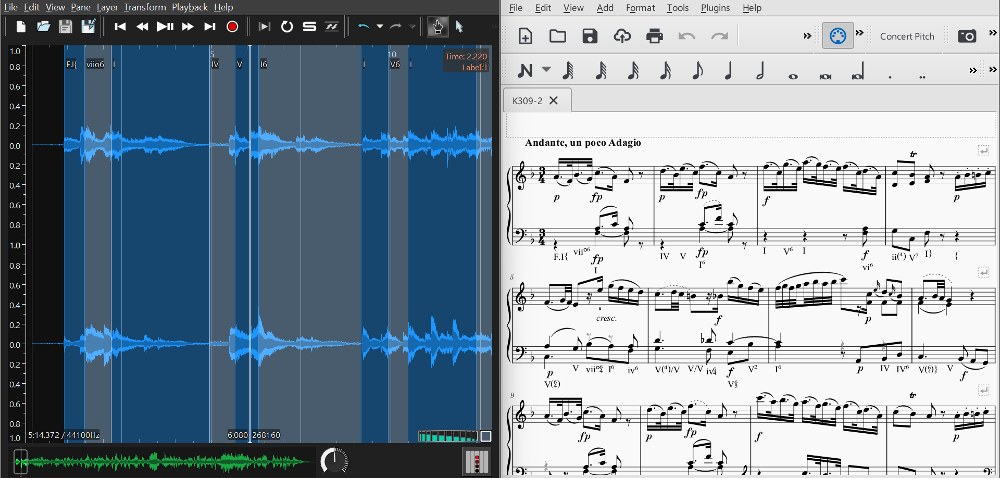

# Aligning audio to annotated score labels from the Annotated Mozart Sonatas dataset

## Intro

This repository proposes a pipeline to perform the alignment between an audio recording of a piece present in DCML Mozart sonatas corpus [1], using Sync Toolbox dynamic time warping (DTW) tools [2]. 

## Prerequisites
### Installation requirements

### Dataset preparation

First, download the corpus via https://github.com/DCMLab/mozart_piano_sonatas.

Second, navigate to the top level of the mozart_piano_sonatas repository and generate the notes and labels files
needed for audio-to-annotation alignment by running:

`python ms3 extract -N [folder_to_write_notes_file_to] -X [folder_to_write_labels_file_to] -q`

This will provide additional quarterbeats information needed for alignment.

## Tutorial

### Command line

Once the files locations are all identified, you can run:

`python aligner.py -a [audio_WAV_file] -n [notes_TSV_file] -l [labels_TSV_file] -o [CSV_file_to_write_results_to]`

This default command line will store a CSV file with minimal information i.e. labels and corresponding timestamps,
useful to visualize (e.g. with *SonicVisualiser*).

[to add: detail `mode`]

### Playground notebook [to add later]

### Results visualization

#### Visualize labels alignment

For labels visualization purposes, only the `compact` mode is needed when running `aligner.py`. 

1. Open *SonicVisualiser* and open the audio file used for alignment.

2. Then, click on `File/Import Annotation Layer` (`Ctrl+L`)and open the alignment result CSV file.

3. Identify columns and their heading category: *time* for `start` and *label* for `Label`. Make sure to check "First row contains column headings".

4. You can change display settings in the *Property Boxes* of the right pane with `View/Show Property Boxes` (`X`). For example, select *Segmentation* for *Plot Type* of the annotation layer.

5. Open the score in *Musescore*. Opening both *SonicVisualiser* and *Musescore* side by side, you can follow the temporal alignment of labels on the audio and the score at the same time.

   

   

#### Visualize notes (score-following-like mode) [to be added]

## Notes and leads of improvement

- Notes or labels TSV files may contain unexpected additional fields
  - Solution: 
    - identify them all and add them to `utils.py/align_warped_notes_labels`
    - rewrite `utils.py/align_warped_notes_labels` so that it is less (or not) sensitive to columns lists
- Has not been tested for pieces containing repetitions
  - Solution:
    - Test for repeating pieces (should not give conclusive results, if not raising errors)
    - Investigate DTW improvements as proposed in *Automatic Alignment of Music Performances with Structural Differences* [3]

## References

[1] Hentschel, J., Neuwirth, M. and Rohrmeier, M., 2021. 
    The Annotated Mozart Sonatas: Score, Harmony, and Cadence. 
    *Transactions of the International Society for Music Information Retrieval*, 4(1), pp.67–80. 
    [https://github.com/DCMLab/mozart_piano_sonatas]

[2] Müller, M., Özer, Y., Krause, K., Prätzlich, T., Driedger, J., and Zalkow, F., 2021. 
    Sync Toolbox: A Python Package for Efficient, Robust, and Accurate Music Synchronization. 
    *Journal of Open Source Software (JOSS)*, 6(64).
    [https://github.com/meinardmueller/synctoolbox]

[3] Grachten, M., Gasser, M., Arzt, A., and Widmer, G., 2013. 
	Automatic Alignment of Music Performances with Structural Differences.
	*Proceedings of the International Society for Music Information Retrieval Conference (ISMIR)*, pp. 607–612

