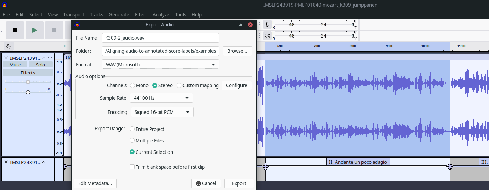

# Creating the audio example

## Quick version

Convert K309-2_audio.mp3 to K309-2_audio.wav. For example, you could use VLC or:

```bash
ffmpeg -i K309-2_audio.mp3 K309-2_audio.wav
```

## Original version

The original audio recording `IMSLP243919-PMLP01840-mozart_k309_jumppanen.mp3` by Paavali Jumppanen 
is available on https://imslp.org/wiki/Special:ReverseLookup/243919
under a Creative Commons Attribution-NonCommercial-NoDerivs 3.0 license.
The text file `IMSLP243919-PMLP01840-mozart_k309_jumppanen_movements.txt` contains timestamps and labels 
delimitating the four movements and the applause at the end of the recording.
You can import both files into Audacity (for the labels use `File > Import > Labels...`),
select the second movement, and export the audio to `K309-2_audio.wav` as shown in the following screenshot:



# Creating the alignment

In the example directory, run the following command:

    python ../aligner.py -a K309-2_audio.wav -n K309-2.notes.tsv -l K309-2.harmonies.tsv -o K309-2_aligned.csv 